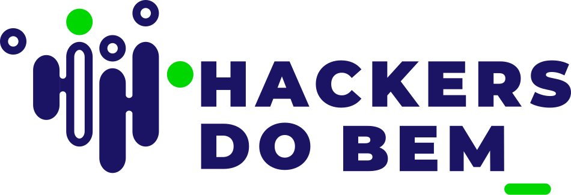

<h1>
    
    <b>Programa Hackers do Bem</b>
</h1>

🎯 **Treinamento em cibersegurança** 

O programa **Hackers do Bem** visa a capacitação de qualidade com os selos do **Senai (SP)** e da **Escola Superior de Redes (RNP)**.  A formação é aberta para estudantes do ensino técnico, médio e superior, profissionais da área de tecnologia que buscam especialização e profissionais que procuram migrar de área. O programa tem como objetivo desenvolver recursos humanos em cibersegurança, portanto, não é necessário ter experiência para se inscrever na formação, que é totalmente online. A plataforma virtual de aprendizado conta com videoaulas, quizes, animações, aulas ao vivo e exercícios teóricos e práticos com a utilização de simuladores.

**Acesse o curso:**  
 
 

## Conteúdo Programático ⌛

### **São cinco trilhas:** 

- Cursos de Nivelamento;
- Básico;
- Fundamental;
- Especializado;
- Residência Tecnológica.

### Cursos de Nivelamento:

- Introdução à cibersegurança
- Identificar componentes de hardware de computador
- Compreender a internet 
- Compreender a camada de acesso à rede e a camada de internet (IP)
- Compreender o IPV6 e a camada de tranporte
- Compreender a camada de aplicação / serviços de rede
- Uso do Windows
- Uso do Linux
- Lógica de programação com introdução ao Python
- Desenvolvimento de scripts: ShellScript e PowerShell

## Redes Socias

 

<table>
  <tr>
    <td>
      
    </td>
    <td align="left">
      <a href="https://github.com/Mdsoare">
        <b>Marcelo Soares</b>
      </a>
       
      Analista de Sistemas
    </td>
  </tr>
</table>

## Referências 🔎
- [W3SHOOLS](https://www.w3schools.com/)
- [BADGES](https://hendrasob.github.io/badges/)

##

Disponibilizado por <a href="https://github.com/Mdsoare">🕶 Marcelo Soares ®</a>.

